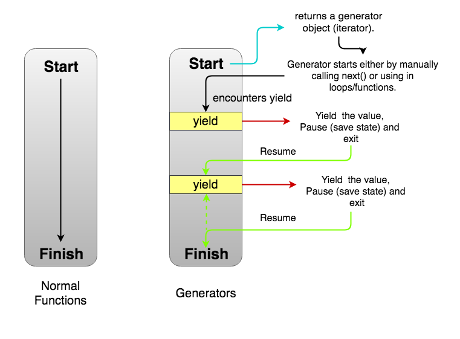

# Henry

## Generators

> "Generator Functions are functions that can be exited and later re-entered. Their context (variable bindings) will be saved across re-entrances"

Los generators son funciones que a diferencia de las que conocíamos hasta el momento pueden detener su ejecución para luego retomar el control más adelante en el flujo del programa. Al volver a la función luego de una "pausa", el contexto sigue siendo el mismo, por lo que sus variables no se van a ver afectadas.

Podrían hacer la analogía de este tipo de funciones con un control remoto en el cual podemos pausar lo que estemos viendo y luego, cuando lo deseemos, volver a darle "play" o incluso dejar de ver lo que estábamos mirando (stop).

### Run-to-completion Model

Lo que usualmente conocemos como "Run-to-completion Model" es el paradigma sobre el cual se basan todas las funciones de JS, a excepción de los generators. La idea principal consiste en que toda función va a ejecutarse por completo hasta llegar a su última instrucción o punto de salida, ya sea por:

  - Return statement
  - Error thrown
  - Fin de instrucciones (implicit undefined return)

### Generators Model

Por su parte el modelo en que se basan los generators previamente explicado consta de

  - __Ejecución inical__: retorna un "generator object" que va a ser nuestro iterador
  - __Comienzo__: comienza a ejecutarse el generator cuando se invoca la instrucción `next` o a través de algún ciclo de iteración
  - __"Pausas"__: puede tener una cantidad infinita de puntos de pausa en los cuales se guarda su contexto y se cede nuevamente el control a la función o programa que invocó al generator
  - __Resume__: luego de cada pausa es posible que el generator tome nuevamente el control para continuar con sus operaciones
  - __Fin__: una vez completadas o pasados todos los puntos de pausa el generator llega a su fin

La siguiente imagen muestra en detalle las diferencias entre ambos modelos recién expuestas:

<p align="center">
  
</p>

### Generators Syntax

```javascript
function* generatorShowInstructors() {
  console.log("Iniciando generator function");
  yield "Franco";
  yield "Toni"
  console.log("Generator function terminada");
}

var generatorObject = generatorShowInstructors();

generatorObject.next();
```

En primer lugar para poder definir un generator debemos utilizar la sintaxis `function*` lo que va a indicar que la misma debe retornar un `Generator Object`.

Una vez definida dicha función podemos invocarla al igual que cualquiera de las funciones que ya conocíamos de antes. La particularidad que tienen los generators es que no se va a ejecutar el cuerpo de la función una vez que hagamos la invocación de la misma, en el ejemplo: `generatorShowInstructors()` sino que simplemente nos va a devolver como mencionamos antes un `Generator Object` que nos va a permitir luego "controlar" esta función.

Una vez obtenido nuestro iterador podemos invocar las veces que queramos al método `next()` que se va a encargar ahora si de ejecutar el cuerpo del generator previamente invocado hasta llegar a un "punto de pausa" que se van a identificar con la palabra reservada `yield`.

Para que quede más claro veamos como sería el flow de ejecución del ejemplo de arriba

```javascript

var generatorObject = generatorShowInstructors();
// En este punto todavía no se ejecutó nada del cuerpo de la función generatorShowInstructors
// Simplemente tenemos guardado en la variable generatorObject el justamente Generetor Object
// que nos va a servir como iterador y poder controlar el generator

var firstNext = generatorObject.next();
// La primera vez que ejecutamos el método next sobre el iterador vamos a ejecutar las instrucciones
// de la función generatorShowInstructors hasta encontrar el primer yield

function* generatorShowInstructors() {
  console.log("Iniciando generator function");  // <-- Se ejecuta
  yield "Franco";                               // <-- Se pausa le ejecución
  yield "Toni"
  console.log("Generator function terminada");
}

// Si observamos que quedó almacenado en firstNext obtendremos un objeto de la siguiente forma:
{
  done: false,
  value: "Franco"
}
// Es decir tenemos información sobre el estado de nuestro generator.
// Por un lado la propiedad done nos indica que el generator aún no ha finalizado
// y por otro lado el value corresponde con el valor actual que tiene el generator en
// este punto de pausa que se corresponde con el valor que se coloqué después de la palabra
// yield

// Si volvemos a ejecutar next, ¿qué creen que sucederá?
var secondNext = generatorObject.next();

function* generatorShowInstructors() {
  console.log("Iniciando generator function");
  yield "Franco";                               
  yield "Toni"                                  // <-- Avanza hasta acá y se pausa le ejecución
  console.log("Generator function terminada");
}

// Lo que sucede es que vuelve a tomar el control el generator y vuelve a avanzar hasta el próximo
// punto de pausa o hasta su finalización (lo que ocurra primero)
// Por lo que si observamos ahora que contiene secondNext:
{
  done: false,
  value: "Toni"
}

// Otra vez :D
var thirdNext = generatorObject.next();

// Obtenemos:
{
  done: true,
  value: undefined
}

// Que nos está indicando que efectivamente el generator llegó a su fin ya que done es igual a true
```

### Yield vs Return

Si bien a simple vista pueden parecer equivalentes tanto el `yield` como el `return`, no lo son:

 - Yield: se encarga de establecer los "puntos de pausa" por lo que al llegar a un yield se pausa el generator y se retorna un objecto como el que vimos en el ejemplo de arriba que indica el estado actual del generator
 - Return: una vez que se alcanza un return statement dentro de un generator, se finaliza su ejecución seteando el valor de "done" del objeto devuelto en true.

```javascript
  function* generatorUnreacheableValue() {
   console.log("Iniciando generator function");
   yield "First reacheable value";
   yield "Second reacheable value";
   return "Return executed";
   yield "Unreacheable value"
  }

 var generatorObject = generatorUnreacheableValue();

 generatorObject.next(); // <-- {done: false, value: "First reacheable value"}
 generatorObject.next(); // <-- {done: false, value: "Second reacheable value"}
 generatorObject.next(); // <-- {done: true, value: "Return executed"}
 generatorObject.next(); // <-- {done: true, value: undefined}

 // Vamos a poder seguir ejecutando el método "next" sobre generatorObject pero como el generator
 // ya finalizó vamos a seguir obteniendo siempre el mismo resultado: {done: true, value: undefined}
 // En este ejemplo la instrucción `yield "Unreacheable value"` nunca va a ser ejecutada.
```

### Infinite Generator

Es posible también definir generators cuyo flow de ejecución sea infinito que no quiere decir que va a estar ejecutandose en background por tiempo indefinido sino que nosotros somos quienes tenemos el control y podríamos en caso de querer ejecutar el método `next` infinitas veces.

A continuación definiremos un generador de números naturales:

```javascript
function* naturalNumbers() {
  let number = 1;
  while(true) {
    yield number;
    number = number + 1;
  }
}

var generatorObject = naturalNumbers();

generatorObject.next(); // <-- Retorna {done: false, value: 1}
generatorObject.next(); // <-- Retorna {done: false, value: 2}
generatorObject.next(); // <-- Retorna {done: false, value: 3}
generatorObject.next(); // <-- Retorna {done: false, value: 4}

// En value tendremos la secuendia de números naturales que queríamos
```

## Async/Await
